# PulseChat Backend

Express.js backend server for PulseChat real-time messaging application with Socket.IO, Kafka, Redis, and PostgreSQL.

## Overview

This is the backend server for PulseChat, built with Express.js and TypeScript. It handles real-time communication through Socket.IO with Redis adapter, uses Apache Kafka as a message broker for handling large message volumes, and PostgreSQL for persistent data storage.

## Tech Stack


## Features

- **Real-time messaging** with Socket.IO and cloud Redis adapter
- **High-throughput message handling** with cloud Apache Kafka service
- **Persistent storage** with cloud PostgreSQL
- **Scalable Socket.IO** with cloud Redis for multi-server support
- **Message delivery guarantees** through managed Kafka service
- **TypeScript** for type safety
- **Cloud-native architecture** for easy deployment and scaling

## Architecture

```mermaid
graph TB
    subgraph "Client Layer"
        A[Next.js Frontend]
    end
    
    subgraph "Server Layer"
        B[Express.js Server]
        C[Socket.IO Handler]
    end
    
    subgraph "Message Processing"
        D[Kafka Producer]
        E[Apache Kafka<br/>Message Broker]
        F[Kafka Consumer]
    end
    
    subgraph "Data Layer"
        G[Redis<br/>Socket.IO Adapter<br/>& Sessions]
        H[PostgreSQL<br/>Message Storage]
    end
    
    A -->|Socket.IO Connection| C
    C -->|Real-time Events| B
    B -->|Publish Message| D
    D -->|Queue Message| E
    E -->|Process Message| F
    F -->|Store Message| H
    C -.->|Scale Across Servers| G
    B -->|Broadcast to Clients| C
    C -->|Real-time Updates| A
    
    style A fill:#61dafb
    style B fill:#68217a
    style C fill:#010101
    style E fill:#231f20
    style G fill:#dc382d
    style H fill:#336791
```




### Data Flow:
1. **Client Connection**: Next.js frontend connects via Socket.IO
2. **Message Reception**: Express server receives message through Socket.IO handler
3. **Cloud Kafka Publishing**: Server publishes message to cloud Kafka service for reliable processing
4. **Message Queuing**: Cloud Kafka handles high message volumes and ensures delivery guarantees
5. **Database Storage**: Kafka consumer processes messages and stores in cloud PostgreSQL
6. **Real-time Broadcasting**: Socket.IO broadcasts message to all connected clients
7. **Cloud Scaling**: Cloud Redis adapter enables Socket.IO to scale across multiple server instances

## Prerequisites

- Node.js (v16 or higher)
- npm or yarn
- **Cloud Services Setup**:
  - Cloud PostgreSQL (AWS RDS, Supabase, ElephantSQL)
  - Cloud Redis (Redis Cloud, AWS ElastiCache, Upstash)
  - Cloud Kafka (Confluent Cloud, AWS MSK, Upstash Kafka)

## Installation

1. **Clone the repository**
```bash
git clone https://github.com/HarshS490/pulsechat-backend.git
cd pulsechat-backend
```

2. **Install dependencies**
```bash
npm install
```

3. **Environment Setup**
```bash
cp .env.example .env
```

4. **Configure environment variables**
```env
# Server Configuration
PORT=8000
DATABASE_URL=your_database_url
DIRECT_URL=your_database_direct_url #used for migration (optional)
JWT_SECRET=your_jwt_secret  # for hashing JWTs
REDIS_PORT=6379
REDIS_END_POINT=your_cloud_redis_url
REDIS_PASSWORD=your_redis_password
IO_REDIS_URL=io_redis_url
AIVEN_KAFKA_HOST=your_cloud_kafka_host_name
AIVEN_KAFKA_USERNAME=your_cloud_kafka_username
AIVEN_KAFKA_PASSWORD=your_kafka_password
FRONTEND_URL="http://localhost:3000"

```

5. **Set up cloud services**
   - **PostgreSQL**: Use a cloud provider like AWS RDS, Supabase, or ElephantSQL
   - **Redis**: Use Redis Cloud, AWS ElastiCache, or Upstash
   - **Kafka**: Use Confluent Cloud, AWS MSK, or Upstash Kafka

6. **Start the development server**
```bash
npm run dev
```

The server will start at `http://localhost:8000`

## Project Structure

```
C:\Users\dell\Documents\projects\chat-app\server
├── 📄 .env
├── 📄 .gitignore
├── 📄 ca.pem
├── 📄 package.json
├── 📄 package-lock.json
├── 📄 README.md
├── 📄 tsconfig.json
│
├── 📁 src/                          # Source TypeScript files
│   ├── 📄 index.ts                  # Main server entry point
│   ├── 📄 socket.ts                 # Socket.IO configuration
│   ├── 📄 custom-types.d.ts         # Custom type definitions
│   │
│   ├── 📁 config/                   # Configuration files
│   │   ├── 📄 kafka.ts              # Kafka configuration
│   │   ├── 📄 prisma.ts             # Prisma ORM setup
│   │   └── 📄 redis.ts       # Redis configuration
│   │
│   ├── 📁 controllers/              # Route handlers
│   │   ├── 📄 auth.controller.ts    # Authentication logic
│   │   ├── 📄 conversation.controller.ts # Chat conversations
│   │   ├── 📄 friends.controller.ts # Friend management
│   │   └── 📄 users.controller.ts   # User management
│   │
│   ├── 📁 middlewares/              # Express middlewares
│   │   └── 📄 AuthMiddleware.ts     # Authentication middleware
│   │
│   ├── 📁 models/                   # Data models & schemas
│   │   └── 📄 auth.schemas.ts       # Authentication schemas
│   │
│   └── 📁 routes/                   # API routes
│       └── 📄 routes.ts             # Route definitions
│
│
└── 📁 prisma/                       # Database migrations
    └── 📁 migrations/
    └── schema.prisma
```

### API Endpoints

### Messages
```
GET  /api/messages - Get message history
POST /api/messages - Send message (alternative to Socket.IO)
```

### Health Check
```
GET  /health - Server health status
```

## Socket.IO Events

### Server Listens To:
- `send-message`: User sends a message

### Server Emits:
- `receive-message`: Broadcast new message

## Kafka Topics

- `messages`: All chat messages queued for processing and database storage

## Key Services

### Socket.IO Service (`src/socket.ts`)
- Handles real-time WebSocket connections
- Uses Redis adapter for scaling across multiple server instances
- Manages message broadcasting to connected clients

### Kafka Service (`src/config/kafka.ts`)
- Producer: Publishes messages to cloud Kafka topics
- Consumer: Processes messages from cloud Kafka and saves to database
- Handles high-throughput message processing with managed Kafka service


## Available Scripts

```bash
# Start development server with nodemon
npm run dev

# Start production server
npm start

# Run database migrations
npm run migrate

# Rollback migrations
npm run migrate:rollback

# Seed database
npm run seed

# Run tests
npm test

# Run linting
npm run lint
```

## Performance Optimizations

- **Cloud Redis Socket.IO Adapter**: Enables horizontal scaling across multiple server instances using managed Redis
- **Cloud Kafka Message Queuing**: Handles high-throughput message processing with managed Kafka service
- **Cloud Database**: PostgreSQL connection pooling with cloud database providers
- **TypeScript**: Compile-time type checking for better code quality and performance
- **Managed Services**: Reduced operational overhead with cloud-managed infrastructure

## Monitoring

- **Health Check**: `GET /health` endpoint
- **Metrics**: Custom metrics for message throughput
- **Logging**: Structured logging with Winston
- **Error Tracking**: Comprehensive error handling

## Environment Variables

| Variable | Description | Default |
|----------|-------------|---------|
| `PORT` | Server port | `8000` |
| `DATABASE_URL` | Cloud PostgreSQL URL | Required |
| `DIRECT_URL` | PostgreSQL Direct Url | Optional |
| `REDIS_END_POINT` | Cloud Redis connection URL | Required |
| `REDIS_PASSWORD` | Cloud Redis Password | Required |
| `REDIS_PORT` | Redis port | `6379` |
| `IO_REDIS_URL` | Redis URL | Required |
| `AIVEN_KAFKA_USERNAME` | Aiven Kafka username | Required |
| `AIVEN_KAFKA_PASSWORD` | Aiven Kafka password | Required |
| `AIVEN_KAFKA_HOST` | Aiven Kafka HOST | Required |
|`JWT_SECRET` | Secret for hashing JWT | Required|
|`FRONTEND_URL` | Frontend client base url | `http://localhost:3000`|

## Contributing

1. Fork the repository
2. Create your feature branch (`git checkout -b feature/amazing-feature`)
3. Commit your changes (`git commit -m 'Add amazing feature'`)
4. Push to the branch (`git push origin feature/amazing-feature`)
5. Open a Pull Request

## Related Repositories

- **Frontend**: [PulseChat Frontend](https://github.com/HarshS490/pulsechat-frontend)

## Support

For backend-specific issues, please create an issue in this repository or contact the development team.
